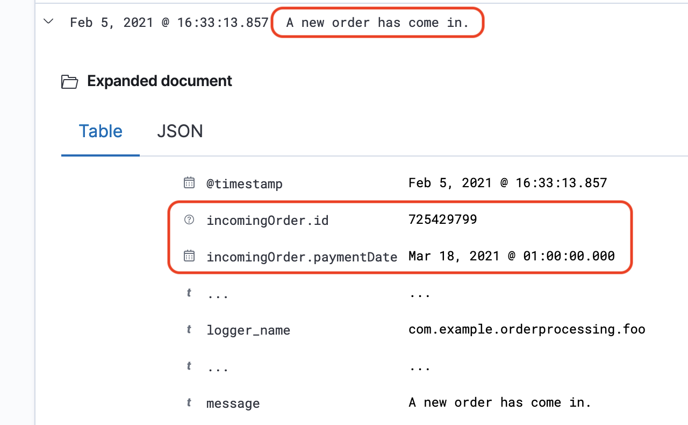

# Structured Logging

[](https://dmtech.de/) 
[](LICENSE)
[](https://github.com/dm-drogeriemarkt/structured-logging/actions?query=branch%3Amaster)
[](https://maven-badges.herokuapp.com/maven-central/de.dm.infrastructure/structured-logging)

Structured Logging is a library that complements [SLF4J](http://www.slf4j.org/) and
its  [MDC](http://logback.qos.ch/manual/mdc.html) to

* augment log messages with information about the context in which they happen
* manage
    * the lifetime of that context information
    * serialization of that context information

## Why?

Imagine that ...

1. you do a `log.info("A new order has come in.");` and automatically get the order object attached to that Message
1. the order has a `total`, `customerId` and an `id` field

Now you can

1. **trace** the order via its `id` and see what log messages it produced.
1. **alert** based on `customerId` field because the same customer suspiciously placed 50 orders within one day
1. **get an overview** of the median `total` of orders, or the distribution of `total`s in the visualization tool of your choice


all without writing more code, because you already have all information you need in the context of your log messages.

## How?

If there are log messages that happen in the context of an order, you may want to attach information about that order to
these log messages.

```java
    mdc(incomingOrder, () -> {
        log.info("A new order has come in.");
        
        if(isValid(incomingOrder)){
            prepareForDelivery(incomingOrder);
        }
    });
```

The `incomingOrder` will be attached to the log messages generated in the supplied lambda, including

* the message from `log.info("A new order has come in.")` .
* all messages logged by `prepareForDelivery(...)`, `isValid(...)`
* all messages logged by methods called indirectly by the methods above

Here's what a log message with an `incomingOrder` looks like in Kibana:



---

**Table of Contents**

* [Why?](#why)
* [How?](#how)
* [Advantages](#advantages)
  * [Advantages over plain logging](#advantages-over-plain-logging)
  * [Advantages over using MDC directly](#advantages-over-using-mdc-directly)
* [Prerequisites](#prerequisites)
* [Getting Started](#getting-started)
  * [Step 1: Add structured-logging as a dependency](#step-1-add-structured-logging-as-a-dependency)
  * [Step 2: Configure Logback](#step-2-configure-logback)
  * [Step 3: Put Objects into the logging context](#step-3-put-objects-into-the-logging-context)
  * [Step 4: (Optional) Use the Task Decorator](#step-4-optional-use-the-task-decorator)
  * [Step 5: (also Optional) Test your logging](#step-5-also-optional-test-your-logging)
* [Advanced usage](#advanced-usage)
  * [Define how Objects should be named in MDC](#define-how-objects-should-be-named-in-mdc)
  * [Use try-with-resources instead of a callback](#use-try-with-resources-instead-of-a-callback)
  * [Changing serialization by using Jackson annotations](#changing-serialization-by-using-jackson-annotations)
  * [Changing serialization by using a custom ObjectMapper](#changing-serialization-by-using-a-custom-objectmapper)
* [Changes](#changes)
  * [3.0.2](#302)
  * [3.0.1](#301)
  * [3.0.0](#300)
  * [2.0.6](#206)
  * [2.0.5](#205)
  * [2.0.4](#204)
  * [2.0.3](#203)
  * [2.0.2](#202)
  * [2.0.1](#201)
  * [2.0.0](#200)
  * [1.0.3](#103)
* [FAQ and Caveats](#faq-and-caveats)

---

## Advantages

This approach has various advantages over both plain logging as well as
using [MDC](http://logback.qos.ch/manual/mdc.html) directly.

### Advantages over plain logging

* If you log context information, you can easily trace the order from the example above by filtering
  by `incomingOrder.id : 1234`
* Searching is easier if the log message itself does not vary that much (just search
  for `message : "A new order has come in."`)
* Because the type of fields can be inferred, you can for example search by `incomingOrder.paymentDate > 2020-01-01`
* You don't have to remember to attach context information to every log message: Context information is attached automatically while the context is active.
* You can do alerting and monitoring based on specific MDC values. Want to know the summary monetary value of
  those `incomingOrder`s in the example above? You can now do that.

### Advantages over using MDC directly

Structured Logging adds crucial features missing from plain [MDC](http://logback.qos.ch/manual/mdc.html), even when
using MDC's [putCloseable](http://www.slf4j.org/api/org/slf4j/MDC.html#putCloseable(java.lang.String,java.lang.String)):

* Proper serialization of complex objects and their fields is taken care of. MDC itself does not support a hierarchical
  structure, although most log processors like logstash do support it.
* MDC is properly reset after the `try` block if it contained another value before.
* If a task in another thread is started, context information is retained because it is still relevant. This is solved
  by providing a custom Task Decorator (see below).

## Prerequisites

For creating logs:

* You need to use **SLF4J** as your logging facade.
* You need to use **logback** as your logging implementation.
* **Optionally**, you can use **Spring** which uses both of these per default and already lets you register Task
  Decorators. This library [does not depend on Spring](#faq-and-caveats), however. Other frameworks (or no framework at all) work just as well. 

For consuming logs:

* Works with log consumers that
  * can digest JSON logs
  * supports hierarchical data in a log messgage
* For example:
  * **ELK Stack** or **Datadog** are well-supported
  * **Greylog** can consume JSON logs, but does not support hierarchical data

## Getting Started

### Step 1: Add structured-logging as a dependency

If you use maven, add this to your pom.xml:

```xml
<dependency>
    <groupId>de.dm.infrastructure</groupId>
    <artifactId>structured-logging</artifactId>
    <version>3.0.2</version>
</dependency>
```

### Step 2: Configure Logback

To log the whole log message including the object you put into MDC as JSON, you need to configure Logback to use the **LogstashEncoder** and **StructuredMdcJsonProvider**.

The following configuration can be used as an example:

```xml

<configuration>
    <include resource="org/springframework/boot/logging/logback/defaults.xml"/>
    <include resource="org/springframework/boot/logging/logback/console-appender.xml"/>

    <appender name="JSON_FILE" class="ch.qos.logback.core.FileAppender">
        <!-- use LogstashEncoder to log as JSON -->
        <encoder class="net.logstash.logback.encoder.LogstashEncoder">
            <!-- use StructuredMdcJsonProvider to log structured data as json in MDC fields -->
            <provider class="de.dm.prom.structuredlogging.StructuredMdcJsonProvider"/>
        </encoder>
        <file>${LOG_LOCATION}</file>
    </appender>

    <root level="INFO">
        <appender-ref ref="JSON_FILE"/>
        <appender-ref ref="CONSOLE"/>
    </root>
</configuration>

```

### Step 3: Put Objects into the logging context

use MdcContext.mdc(...) to define the scope in which context information should be set:

```java
import static de.dm.prom.structuredlogging.MdcContext.mdc;

...

log.info("a message without context");

TimeMachine timeMachine=TimeMachineBuilder.build();

mdc(timeMachine, () -> {
    log.info("time machine found. Trying to use it");

    timeMachine.setFluxFactor(42);

    MdcContext.update(timeMachine);

    travelSomewhenWith(timeMachine);
});

log.info("another message without context");
```

You can also return values:

```java
var currentTime = mdc(timeMachine, () -> {
    timeMachine.setFluxFactor(42);
    return travelSomewhenWith(timeMachine);
});

log.info("another message without context");
```

### Step 4: (Optional) Use the Task Decorator

When you start another thread, MDC will be empty although the things happening there usually happen in the same context.

So if you want to retain the context information in the new thread, there's a decorator for your `Runnable` that solves this problem by copying the current MDC contents to the new Thread in which your `Runnable` runs and resets it when it's done:

```java
Runnable decoratedRunnable = MdcTaskDecorator.decorate(
    () -> doSomethingThatLogs(), 
    OverwriteStrategy.LOG_OVERWRITE
);
```

If you use Spring and start the other thread by calling an `@Async` method, use the `SpringMdcTaskDecorator` for decorating the threads. You just need to configure an Executor:

```java

@Configuration
public class AsyncThreadConfiguration {
    ...

    @Bean
    public Executor asyncExecutor() {
        ThreadPoolTaskExecutor executor = new ThreadPoolTaskExecutor();
        executor.setTaskDecorator(new SpringMdcTaskDecorator(OverwriteStrategy.LOG_OVERWRITE));
        executor.initialize();
        return executor;
    }

    ...
}
```

If you already configured Executors for other reasons, just add `.setTaskDecorator(new MdcTaskDecorator(...))`.

There are three `OverwriteStrategy`s that tell the decorator what to do when it encounters MDC contents in the target thread:

* If you expect MDC content in the target thread, use `JUST_OVERWRITE`.
* If you don't expect MDC content in the target thread, use `LOG_OVERWRITE` or `PREVENT_OVERWRITE`.

Datadog's APM, for example, does give new threads an MDC context for tracing, so in that case use `JUST_OVERWRITE` so you don't get inappropriate warnings.

### Step 5: (also Optional) Test your logging

If you use your logs for monitoring, alerting or visualization, they are a functional requirement and should be
tested.

The tests for **structured-logging** itself are implemented
with **[log-capture](https://github.com/dm-drogeriemarkt/log-capture)**, which can be easily used from JUnit or
Cucumber. Give it a try.

## Advanced usage

### Define how Objects should be named in MDC

There are three ways to define the MDC key for the objects you put into the context:

**1. Use the default (The class's shortName, as seen in [Step 3](#step-3-put-objects-into-the-logging-context))**

**2. Define it manually**

```java
mdc("de_lorean", timeMachine, () -> {
    ...
    MdcContext.update("de_lorean", timeMachine);
    ...
});
```

**3. Provide an MdcKeySupplier**

This is the recommended approach if you want to make sure that the same MDC key is always used for the same type, even
if it differs from the type's shortName or the type is renamed.

First, define the MDC key for the type:

```java
// must be public and have a public, non-parameterized constructor
public final class TimeMachineKey implements MdcKeySupplier<TimeMachine> {
    @Override
    public String getMdcKey() {
        return "de_lorean";
    }
}
```

Then use it:

```java
//MdcContext.of(...) is defined so that you can only use TimeMachineKey with a TimeMachine.
mdc(TimeMachineKey.class, timeMachine, () -> {
    ...
    MdcContext.update(TimeMachineKey.class, timeMachine);
    ...
});
```

### Use try-with-resources instead of a callback

You can also use try-with-resources to manage your MDC context if you prefer that or need to. For example, the following code

1. would not be possible with the callback API because `availableSeats` is not effectively final
1. would be inconvenient, because there are multiple values in the MDC context, which would require nested callbacks
1. may not be possible with the callback API if `seat.isAvaliable()` can throw **multiple** checked Exceptions. The callback API works with one checked Exception, though.

```java
int availableSeats = 0;
seats.forEach(seat -> {
    try (var s = MdcContext.of(seat); var c = MdcContext.of(cinema)) {
        if (seat.isAvailable()) { // isAvailable() also logs
            availableSeats++;
        }
    }
});
```

### Changing serialization by using Jackson annotations

JSON serialization is done with Jackson, so you can use the `com.fasterxml.jackson.annotation` annotations to
fine-tune serialization. Here's an example that excludes a field from serialization:

```java
public class TimeMachine {
    @JsonIgnore
    public getIrrelevantProperty() {
            ...
    }
}
```

### Changing serialization by using a custom ObjectMapper

If you want to use your own ObjectMapper for serialization, you can exchange the used default ObjectMapper by calling `setGlobalObjectMapper`. To reset to the default ObjectMapper, you can use `resetGlobalObjectMapper` at any time.

## Changes

### 3.0.2

* dependencies updated due to logback vulnerability
  
### 3.0.1

* properly serialize Optional and other Java 8 Types provided by jackson-datatype-jdk8
* updated dependencies

### 3.0.0

* **Breaking Change**: Structured Logging now requires Java 17
* **New Feature**: Convenience methods as an alternative to try-with-resources
* updated dependencies

### 2.0.6

* **New Feature**: Made the used ObjectMapper configurable
* updated dependencies

### 2.0.5

* **New Feature**: Added correct serialization of remaining java.time types (Year, YearMonth and MonthDay)

### 2.0.4

* **New Feature**: Added correct serialization of Duration

### 2.0.3

* **Bugfix**: The Task Decorator threw a NullPointerException when resetting MDC contents if the target thread's MDC was empty

### 2.0.2

* **New Feature**: The [Task Decorator](#step-4-optional-use-the-task-decorator) now allows setting an OverwriteStrategy

### 2.0.1

* Added proper serialization for missing JSR310 type **LocalTime**

### 2.0.0

* **Breaking Changes**
  * Renamed MdcContextId to MdcKeySupplier to make its purpose clear
    * **migration**: change your code references from `MdcContextId` to `MdcKeySupplier`
  * Removed generic type information from MdcContext because it is not necessary anymore
    * **migration**: Change every use of `MdcContext<Foo, Bar>` to only `MdcContext`
  * The Task decorator to be used with Spring is now named `SpringMdcTaskDecorator` instead of `MdcTaskDecorator`
    * **migration**: use `SpringMdcTaskDecorator` when creating your Executor bean
* **New Features**
  * Added convenience methods for creating MdcContexts without having an MdcKeySupplier.
  * MdcContext can now be updated
  * Runnables can now directly be decorated via `MdcTaskDecorator` to retain MDC information even when not using Spring.
* **Fixes**
  * Do not create ObjectMapper every time an MdcContext is created.
  * Do not overwrite MDC information in threads that already have a context in MdcTaskDecorator - a WARNing is logged instead because this indicates incorrect usage

### 1.0.3

* Added proper serialization for further JSR310 types. Now properly serializes
    * Instant (new)
    * LocalDate (new)
    * LocalDateTime
    * OffsetDateTime
    * OffsetTime (new)
    * Period (new)
    * ZonedDateTime (new)

## FAQ and Caveats

**Your dependencies include Spring and Lombok. What can I do if I don't want to use Spring and Lombok?**

Actually, **Spring and Lombok are not included** if you just want to use Structured Logging. Spring and Lombok are only needed to build/develop Structured Logging.

So if you add Structured Logging to your dependencies, there are only three dependencies that will be added to your project transitively:

1. **slf4j** which is the logging facade you probably use already
1. **logback** as a concrete implementation of the slf4j api
1. **logback-logstash-encoder** needed to write logs as json

**Is there anything to watch out for when logging that many fields?**

You should be careful when changing the type of a field that you put into your context.
If the indexed type does not match the type that is expected, your log messages may be thrown away. We've seen this happen in ELK.

For example: Your order.id was numeric, now it's alphanumeric, but it's still indexed as a number. In that case, you have two options:

1. contact your ELK admin and tell her about it so she can start re-index
1. rename the field (either order or id) so that the types don't collide

Note that this also applies if just you use MDC directly. However, with Structured Logging it is more likely to happen because you are usually logging more fields.

**Since I'm logging that much now, I also want to test my logging. How can I do that?**

Actually, no one has asked that so far. We just want to to advertise **[log-capture](https://github.com/dm-drogeriemarkt/log-capture)**, which solves this problem.
